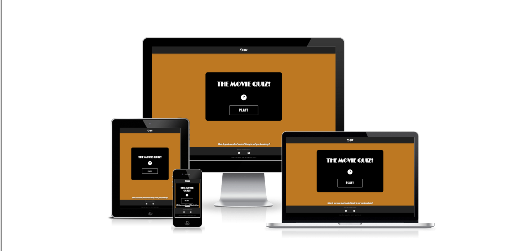
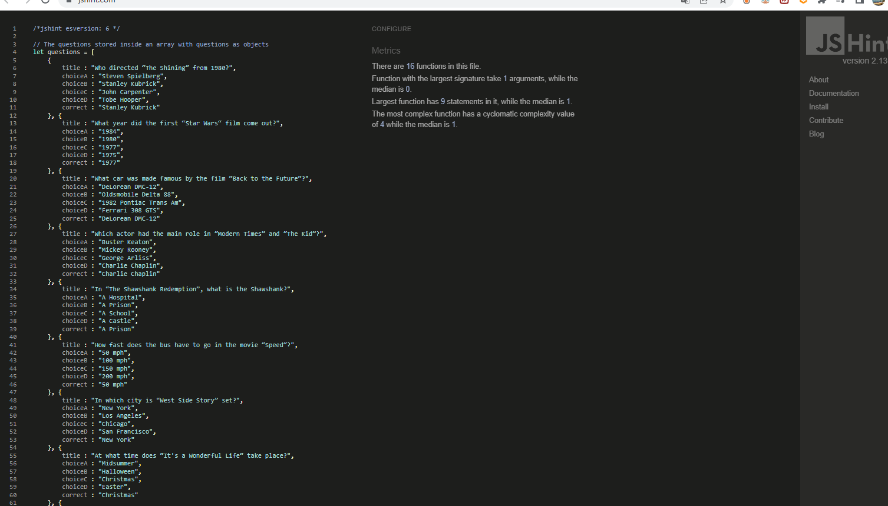
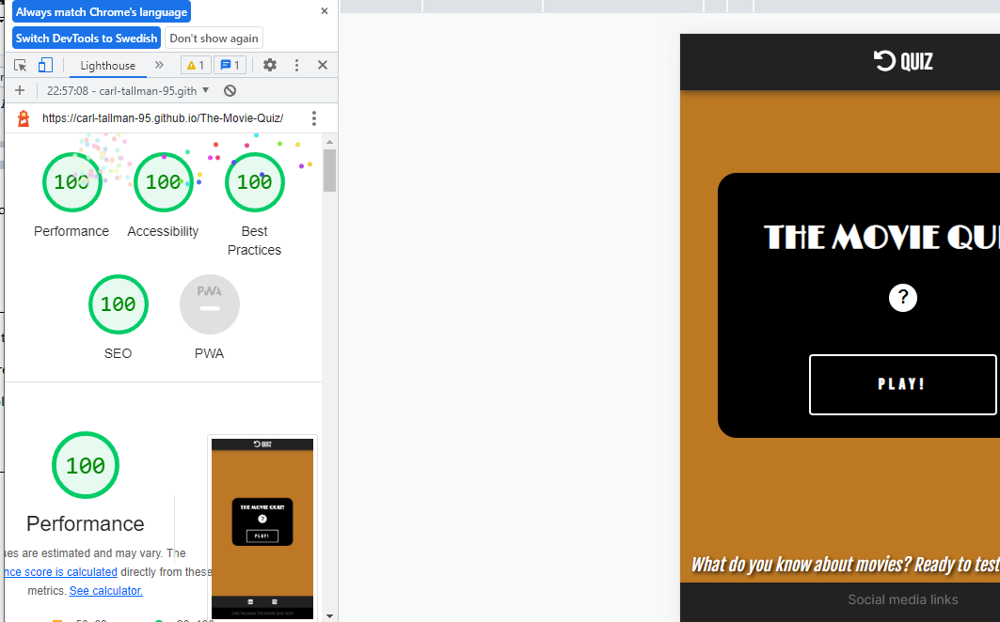
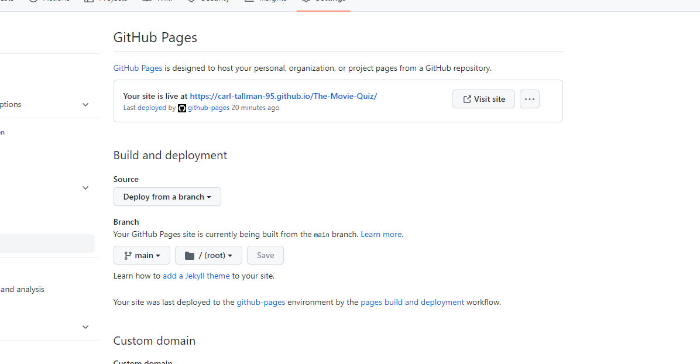

# THE MOVIE QUIZ

This is the website for ”THE MOVIE QUIZ”.
"THE MOVIE QUIZ" is a simple and fun quiz game to test your movie knowlage with friends and/or family members. The quiz will ask 10 varied questions related to popular films.
Whether you want to brush up on your skills or have something to prove, "THE MOVIE QUIZ" is a fun and quick game for anybody who has a love for movies. Are you up for the challange?

## Features

- The Header
    - The header featured at the top of the page shows to the user bar with an icon with the text "QUIZ" next to it that, when clicked, the user is taken back to the home page.
    - The user can at any point click the element in the header to return to the home page for a better user experience.

- "The Title" and "The Modal" / "Instructions"
    - Featured at the top of the quiz game box, the user is introduced by a title screen that displays the name of the game.
    - The title clearly tells the user what game they are about to play and what the subject of the game is about. 
    - Under the title, there is a clickable modal button.
    - The modal button below the title visualy sticks out and suggests the user to click the button for more information about the quiz.
    - When the user opens the modal, a screen appears with straightforward instructions about how to play the game.
    - The background is also darkened down to help the text stand out as a result of opening the modal. This focuses the user to the modal text box.

- The "PLAY" button

    - The "PLAY" button featured under the modal, will start the quiz game and displays the first question to the user.
    - The button is large and clear about what it is used for
    - The button give a clear indication to the user what the result is before clicking it.
    - The button is easily readable with a pleasant design.

- The Quiz Question Number / The Quiz Current Question
    - Displayed on the top of every question, this function will allow the user to know what question they are on and know how many question are left.
    - The question number will uppdate by one when the user clicks on an answer and is taken to the next question.
    - The question number is displayed first for a better user experience and design.

- The Quiz Questions & Answers
    - The question titles displays actual question being asked. The titles change depending on what question number the user is currently being asked. 
    - The question titles are relevant to the subject and uses clear and easly readable text and grammar.
    - There are four available answers displayed below the question title. The user can only pick one that, when clicked, will change to the next questions answers.
    - When a user hovers over an answer, the answer will slightly change and scale up for a more satisfactory user experience.
    - The answers are relevant to the subject with one correct answer for each question and uses easly readable text.

- The Quiz Score
    - The score featured below the answers dislays to the user their current score. Every time the user picks the right answer, the score increases by one.

- The Completed Quiz Screen
    - 

- The footer

    Featured at the bottom of the screen, the footer includes two social media links to my LinkedIn and GitHub profile. When clicked, the links will open in a new tab for easy navigation for the user.
    - The footer encourages users of the site to stay connected with via social media.

**Features Left to Implement**
- I would have liked to make a timer and a randomized question generator to make the game more challenging. This would of course mean that more questions would have to be added.
It would also be useful if the user could enter their name that will be displayed at the end of the quiz along with their score.

## Testing

- I have tested this project site on different web browsers. Google Chrome, Microsoft Edge and Mozilla Firefox have all been tested and are working.
- Tests while using the site on a Samsung smartphone are also working.
- I have confirmed that the site is looking good and is responsive on different screen sizes by using the dev tools device toolbar.

## Bugs
**Solved bugs**
- 

**Unfixed bugs**

- No unfixed bugs.

## Validator Testing

- W3C HTML Validator
    - No errors were found when passing through the official [W3C HTML Validator](https://validator.w3.org/nu/?doc=https%3A%2F%2Fcarl-tallman-95.github.io%2FThe-Movie-Quiz%2F).

- W3C CSS Validator
    - No errors were found when passing through the official [W3C CSS Validator (Jigsaw)](https://jigsaw.w3.org/css-validator/validator?uri=https%3A%2F%2Fcarl-tallman-95.github.io%2FThe-Movie-Quiz%2F&profile=css3svg&usermedium=all&warning=1&vextwarning=&lang=sv).

- JSHint
    - No warnings were found when passing through the official [JSHint JavaScript Validator](https://jshint.com/)
    

- Accessibility
    - I have confirmed that the colors and fonts chosen for this project are easy to read and accessible by using the lighthouse in dev tools.

    

## Deployment

### GitHub pages deployment
- The website was deployed using GitHub pages. To deploy you will need to:
    - Navigate to the GitHub repository, then navigate to the Settings tab.
    - Select the ***Pages***  tab on the left-hand menu.
    - Under the source section drop-down menu, select "Main" branch and save. It should look similar to this:
    

The Live link can be found here - [THE-MOVIE-QUIZ](https://carl-tallman-95.github.io/The-Movie-Quiz/)

 ### Creating a Clone

 ## Credits
**Content**

**Media**
- The fonts used (Bebas Neue,  and ) was taken from [Google Fonts](https://fonts.google.com/).
- The icons used in the header aswell as the footer was taken from the free kit on [Font Awesome](https://fontawesome.com/).