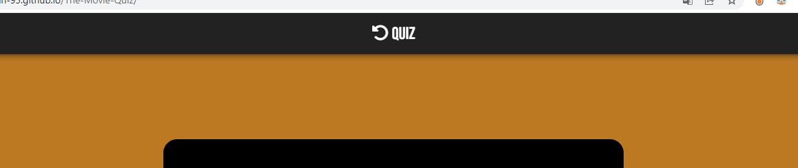
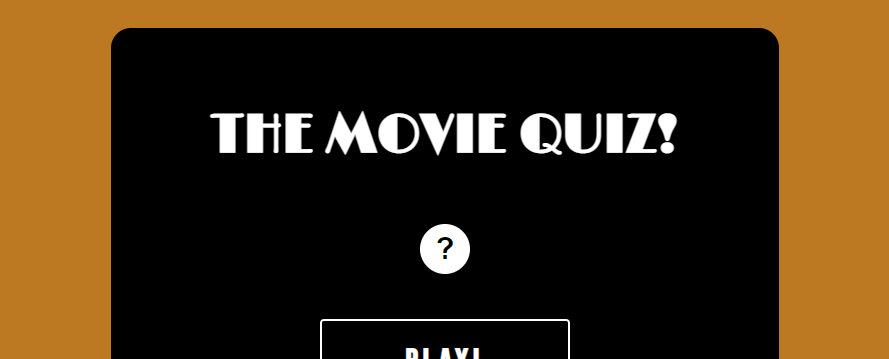
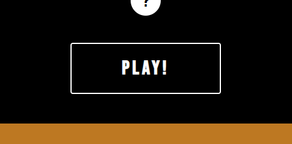
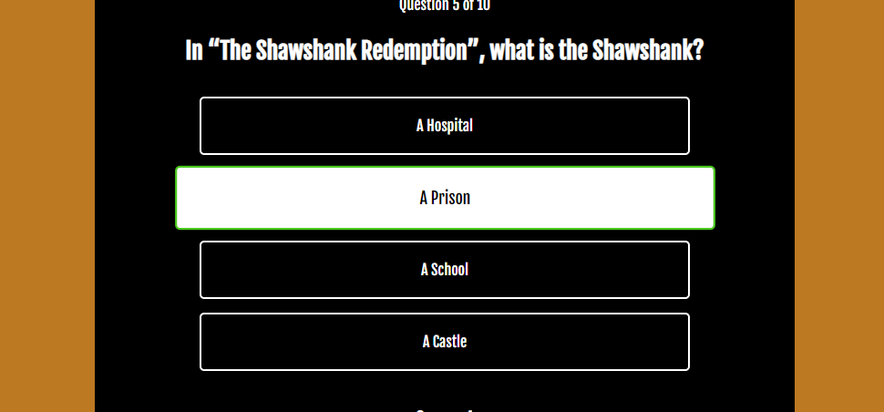
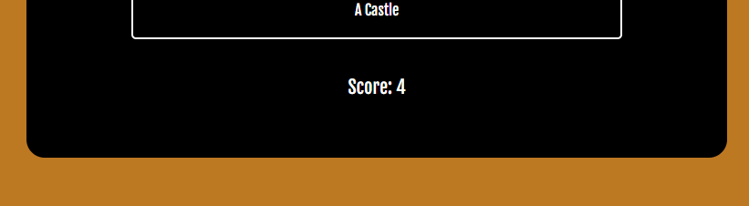
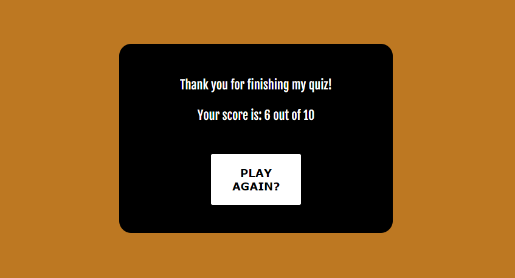
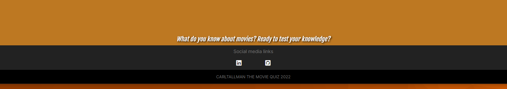

# THE MOVIE QUIZ

This is the website for ”THE MOVIE QUIZ”.
"THE MOVIE QUIZ" is a simple and fun quiz game to test your movie knowledge with friends and/or family members. The quiz will ask 10 varied questions related to popular films.
Whether you want to brush up on your skills or have something to prove, "THE MOVIE QUIZ" is a fun and quick game for anybody who has a love for movies. Are you up for the challenge?


## Features

- The Header Navbar

    - The header navbar featured at the top of the page contains a clickable icon with the text "QUIZ" next to it that takes the user back to the home page.
    - The user can at any point click the icon in the header navbar to return to the home page for a better user experience.



- "The Title" & "The Modal"

    - Featured at the top of the quiz box, the user is introduced to a title screen that displays the name of the game.
    - The title tells the user what game they are about to play and what the subject of the game is about. 
    - Under the title, there is a clickable modal button.
    - The modal button below the title visually sticks out and suggests the user click the button for more information about the quiz.
    - When the user opens the modal, a screen appears with straightforward instructions about how to play the game.
    - The background is also darkened down to help the text stand out as a result of opening the modal.



- The "PLAY" Button

    - The "PLAY" button featured under the modal, will start the quiz game and display the first question to the user when clicked.
    - The button is easily readable and has a simple design.



- The Quiz Question Number

    - Displayed on the top of every question, this function allows the user to know what question they are on and how many questions are left in the quiz.
    - The question number will update by one when the user clicks on an answer.


- The Quiz Questions & Answers

    - The question titles display the actual question being asked. The titles change depending on what question number the user is currently on.
    - The question titles are relevant to the subject and use clear and easily readable fonts and grammar.
    - There are four available answers displayed below the question title. The user can only pick one answer per question. When clicked, the quiz will update to the next question.
    - When a user hovers over an answer, the answer will slightly change in scale for a more satisfactory user experience.
    - All answers are relevant to the subject with only one correct answer for each question.



- The Quiz Score

    - The score featured below the answers displays to the user their current score. Every time the user picks the right answer, the score increases by one.



- The Completed Quiz

    - Once the user has finished the quiz by answering the last question, the quiz box will display a message along with the total score.



- The Footer

    - The footer at the bottom of the screen includes two social media links to my LinkedIn and GitHub profiles.
    - The links will open in a new tab for easier navigation and design when clicked.



**Features Left to Implement**

- I would have liked to make a timer and a randomized question generator to make the game more challenging. Although this would mean that more questions would have to be added.
- Another feature to implement would be if the user could enter their name that displays at the end of the quiz along with their score.

## Testing

- I have tested this project site on different web browsers. Google Chrome, Microsoft Edge and Mozilla Firefox have all been tested and are working.
- Tests while using the site on a Samsung smartphone are also working.
- I have confirmed that the site is responsive on different screen sizes by using the dev tools in Google Chrome.

## Bugs
**Solved bugs**

- I ran into a bug when I was trying to display the answers in the `showAnswerA` function. I would only get ”undefined” as the string for the answer. I checked the array and I realized I had targeted the wrong answer name. I tried to target `answerA` instead of `choiceA`.


- The `displayQuestionNumber(questionIndex)` function within the `displayQuestion` function would display the question number as question ”0 out of 10”. I solved this issue by adding `+1` to the parameter after `questionIndex` so that it starts with "1". This is because indexes start from "0" but the value from the array (`questions.length`) is "10".

- I ran into a ”TypeError” when the last question answer was clicked. This was solved by adding a condition inside the `goToNextQuestion` function to continue if the index was less than or equal to "9".
    
 ```
 if (currentQuestionIndex <=9) {
        displayQuestion(currentQuestionIndex);
    }
 ```


**Unfixed bugs**

- No unfixed bugs. But a lot of trial and error.

## Validator Testing

- W3C HTML Validator
    - No errors were found when passing through the official [W3C HTML Validator](https://validator.w3.org/nu/?doc=https%3A%2F%2Fcarl-tallman-95.github.io%2FThe-Movie-Quiz%2F).

- W3C CSS Validator
    - No errors were found when passing through the official [W3C CSS Validator (Jigsaw)](https://jigsaw.w3.org/css-validator/validator?uri=https%3A%2F%2Fcarl-tallman-95.github.io%2FThe-Movie-Quiz%2F&profile=css3svg&usermedium=all&warning=1&vextwarning=&lang=sv).

- JSHint
    - No warnings were found when passing through the official [JSHint JavaScript Validator](https://jshint.com/)
    

- Accessibility
    - I have confirmed that the colors and fonts chosen for this project are easy to read and accessible by using the lighthouse function in the Google Chrome dev tools.

    

## Deployment

### GitHub pages deployment
- The website was deployed using GitHub pages. To deploy you will need to:
    - Navigate to the GitHub repository, then navigate to the Settings tab.
    - Select the ***Pages***  tab on the left-hand menu.
    - Under the source section drop-down menu, select "Main" branch and save. It should look similar to this:
    

The Live link can be found here - [THE-MOVIE-QUIZ](https://carl-tallman-95.github.io/The-Movie-Quiz/)

 ### Creating a Clone
- To run this project locally you will need to:
    
    - Install the GitPod Browser Extension for the Google Chrome browser.

    - After you have installed the extension, you can restart the browser and log into GitHub.
    - First, locate the GitHub Repository, then click the green GitPod button in the top of the repository. A new GitPod workspace will be created from the code in GitHub where you can work locally.

- To the project within a local IDE you will need to:
    - Log into GitHub and locate the GitHub repository.
    - Click the "Code" button below the repository name.
    - Under where it says "Clone" you should see "HTTPS". Copy the repository clone URL under "HTTPs".
    - Open the terminal in your local IDE.
    - Alter the working directory location to where you want the cloned directory to be made.
    - Enter "git clone", then just paste the URL you copied from the clone repository.
    - Press Enter and your local clone should be created.


## Credits

**Content**

- The code to make the header navbar was inspired by [this youtube tutorial](https://www.youtube.com/watch?v=W-nIX17Gg-Q) and [this article](https://www.w3schools.com/css/css_navbar.asp).
- The modal was made using similar code to the examples in this article(https://www.w3schools.com/howto/howto_css_modals.asp)
- I used concepts and guides regarding quiz structure from [this article](https://www.codingninjas.com/blog/2020/11/03/how-to-create-a-quiz-in-javascript/) as well as [this article](https://www.sitepoint.com/simple-javascript-quiz/).
- A lot of credit also goes to [this youtube tutorial](https://www.youtube.com/watch?v=49pYIMygIcU&t=1625s) for explaining the syntax of making a quiz in detail.
- [This article](https://stackoverflow.com/questions/27441803/why-does-jshint-throw-a-warning-if-i-am-using-const) also assisted when testing the code through the JSHint validator to make it accept ES6 code.
- And a big thank you to my mentor [Harry Dhillon](https://github.com/Harry-Leepz) for all the tips and guidance through this project!

**Media**
- The fonts used ('Bebas Neue', 'Fjalla One', and 'Inter') were taken from [Google Fonts](https://fonts.google.com/).
- The icons used in the header as well as the footer were taken from the free icons on [Font Awesome](https://fontawesome.com/).

## Technologies

- HTML
    - Used for the structure of the project.
- CSS
    - Used for styling in the project.
- JavaScript
    - Used for the interactivity and functionality of the project.
- GitHub
    - Used as the hosting platform for the site.